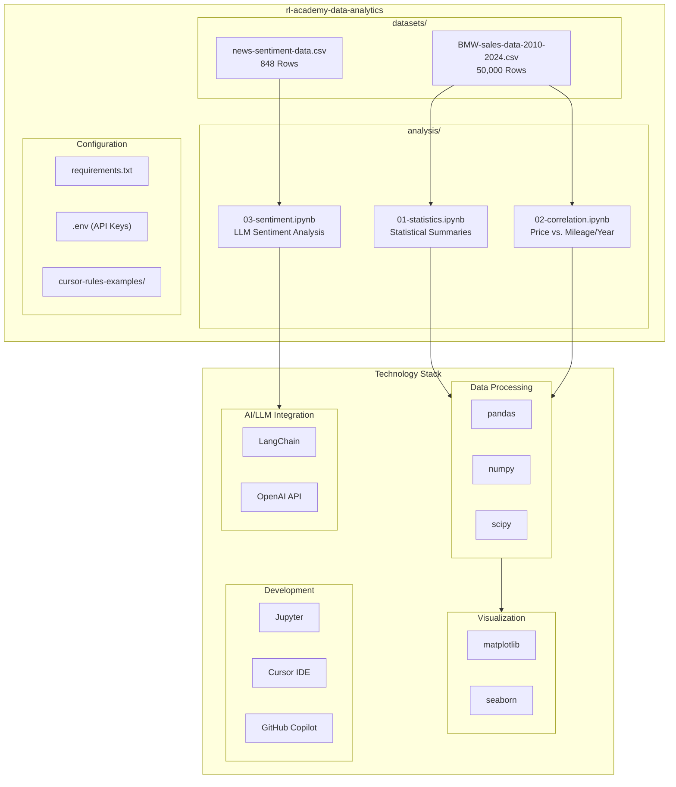

# Data Analysis Project - BMW Sales Data

This project is used as part of the **AI Engineering - Speed & Quality** module to teach Data Analysis with Cursor and GenAI integration.

**Built by [RUBINLAKE GmbH](https://rubinlake.com) for the [AI Academy](https://academy.rubinlake.com)**

## About the Project

This project demonstrates the analysis of BMW sales data using modern data science tools and AI-powered code assistance. It serves as a practical example for efficient data analysis with the help of AI tools like Cursor IDE.

## Project Structure

```
rl-academy-data-analytics/
├── analysis/
│   ├── 01-statistics.ipynb
│   ├── 02-correlation.ipynb
│   └── 03-sentiment.ipynb
├── cursor-rules-examples/
│   └── *.mdc
├── datasets/
│   ├── BMW-sales-data-2010-2024.csv
│   └── news-sentiment-data.csv
├── experiments/
├── requirements.txt
└── README.md
```

## Project Architecture

The following diagram shows the project structure and technology stack:



## Dataset

### BMW Car Sales Record (2010-2024)

**Source:** [Kaggle Dataset](https://www.kaggle.com/datasets/zubairamuti/bmw-car-sales-record-2010-2024)

### About the Dataset

BMW is a world-renowned German automotive brand known for its combination of luxury, performance, and cutting-edge technology. Every BMW vehicle is designed to deliver a smooth driving experience with powerful engines, precise handling, and a premium interior that reflects comfort and modern technology. From sporty sedans to high-end SUVs, BMW focuses on innovation, safety, and a dynamic driving feel that appeals to car enthusiasts worldwide. The distinctive design and high build quality make BMW one of the most respected brands in the automotive industry.

This dataset contains sales records over a 15-year period from 2010 to 2024. The information includes sales of BMW vehicles, various models in different price ranges. From low to high and medium price ranges, all sold models and vehicles in various colors are included, considering every element relevant when purchasing a car.

### Column Description

1. **Model**

   - Description: BMW model name (e.g., X3, i8, 5 Series)

2. **Year**

   - Description: Manufacturing year of the vehicle

3. **Region**

   - Description: Geographic area where the vehicle was sold

4. **Color**

   - Description: Exterior color of the vehicle

5. **Fuel_Type**

   - Description: Type of fuel used (Petrol/Diesel/Hybrid/Electric)

6. **Transmission**

   - Description: Transmission type (Automatic or Manual)

7. **Engine_Size_L**

   - Description: Engine displacement in liters

8. **Mileage_KM**

   - Description: Total mileage in kilometers

9. **Price_USD**

   - Description: Sale price of the vehicle in USD

10. **Sales_Volume**

    - Description: Number of units sold in that year

11. **Sales_Classification**
    - Description: Sales category (High or Low)

---

### News Sentiment Dataset

**Source:** [Kaggle Dataset](https://www.kaggle.com/datasets/hoshi7/news-sentiment-dataset)

### About the Dataset

This dataset contains news articles with associated sentiment ratings. It combines news titles, Reddit discussion titles, the full article text, and a numerical sentiment classification. The dataset is excellent for Natural Language Processing (NLP) tasks such as sentiment analysis, text classification, and examining relationships between news content and public perception.

### Column Description

1. **news_title**

   - Description: Original title of the news article

2. **reddit_title**

   - Description: Title of the Reddit discussion about the article

3. **sentiment**

   - Description: Numerical sentiment rating (e.g., 1.0 for positive, 0.0 for neutral, -1.0 for negative)

4. **text**

   - Description: Full text of the news article

5. **url**
   - Description: URL to the original source of the article

## Installation

### Prerequisites

- Python 3.8 or higher
- pip (Python Package Manager)

#### Install Python (with pip via Homebrew) (macOS)

```bash
# 1. Make sure Homebrew is installed (skip if you already have it)
/bin/bash -c "$(curl -fsSL https://raw.githubusercontent.com/Homebrew/install/HEAD/install.sh)"

# 2. Install Homebrew Python (this brings pip/pip3)
brew install python
```

#### After install, check:

```bash
python3 --version
pip3 --version
```

### Setup

1. Clone or download the repository

2. Create and activate a virtual environment:

```bash
# Create virtual environment
python3 -m venv venv

# Activate virtual environment (MacOS/Linux)
source venv/bin/activate

# Activate virtual environment (Windows)
venv\Scripts\activate
```

3. Install dependencies:

```bash
pip install -r requirements.txt
```

4. Configure environment variables (required for sentiment analysis):

Create a `.env` file in the project root with your OpenAI API key:

```bash
# .env
OPENAI_API_KEY=your-api-key-here
```

> **Note:** The `.env` file is required for running `03-sentiment.ipynb`. You can get an API key from [OpenAI Platform](https://platform.openai.com/api-keys).

5. Install VS Code / Cursor extensions:

To open Jupyter Notebooks directly in Cursor or VS Code, install the following extensions:

- **Python** (`ms-python.python`) - Python language support
- **Jupyter** (`ms-toolsai.jupyter`) - Jupyter Notebook support

After installation:

1. Open the notebook in Cursor/VS Code
2. Select the Python Interpreter from the Virtual Environment (`venv`) via the status bar or `Cmd+Shift+P` → "Python: Select Interpreter"

6. Deactivate virtual environment (when finished):

```bash
deactivate
```

### Libraries Used

- `pandas` - Data manipulation and analysis
- `numpy` - Numerical computations
- `matplotlib` - Data visualization
- `seaborn` - Advanced data visualization
- `scipy` - Statistical analysis and correlation tests
- `jupyter` - Notebook environment
- `langchain` - LLM integration framework
- `langchain-openai` - OpenAI connector for LangChain
- `python-dotenv` - Environment variable management
- `ipywidgets` - Interactive widgets in notebooks

## Usage

The project contains three Jupyter Notebooks in the `analysis/` directory:

- `01-statistics.ipynb` - Statistical summaries and data exploration
- `02-correlation.ipynb` - Correlation analysis (Price vs. Mileage/Year)
- `03-sentiment.ipynb` - LLM-based sentiment analysis (requires OpenAI API key)

Open the notebooks in Jupyter Lab, Jupyter Notebook, or directly in Cursor/VS Code:

```bash
# Open in Jupyter Lab
jupyter lab

# Or open a specific notebook
jupyter notebook analysis/01-statistics.ipynb
```

## Training Context

This project is part of the **AI Engineering - Speed & Quality** training module, which covers the following topics:

- Code assistance systems
- AI-powered code analysis and test automation
- Prompt engineering for better results
- API usage of AI services
- Scaling and monitoring of AI features

**Tools & Technologies:**

- Cursor IDE
- GitHub Copilot
- OpenAI API
- LangChain
- JSON Prompting

## About RUBINLAKE & AI Academy

This project is developed by **RUBINLAKE GmbH** as part of the **AI Academy** training program.

- **RUBINLAKE GmbH**: [https://rubinlake.com](https://rubinlake.com)
- **AI Academy**: [https://academy.rubinlake.com](https://academy.rubinlake.com)

The AI Academy provides comprehensive training in AI engineering, data science, and modern development practices, helping professionals leverage AI tools and technologies effectively.

## License

This dataset is sourced from Kaggle and is subject to the corresponding license terms of the source.
